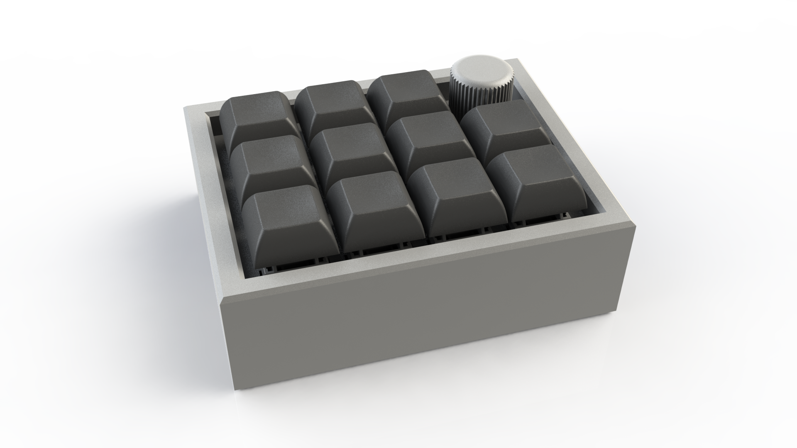
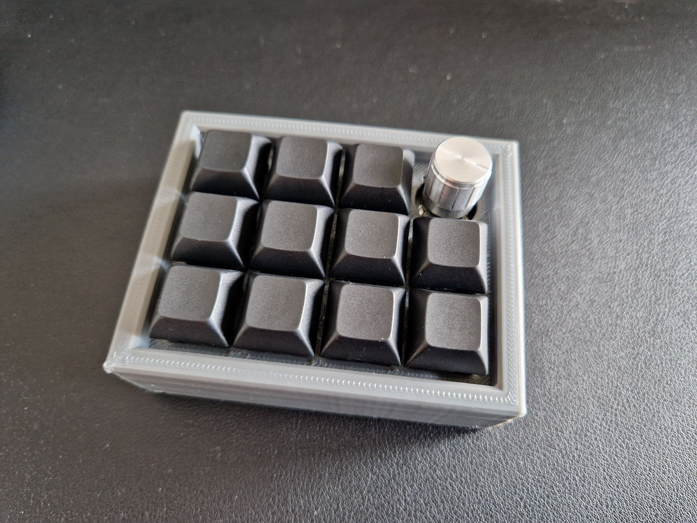

# Cans12erV2

The updated version of my 12-key, 1-encoder, orthogonal keypad with hot swappable keyswitches designed by me!
Programming and customization of each key is planned to be provided by QMK/VIA.

Hardware Supported: RP2040 Zero (clones work too!)

# Build Instructions

## Parts
- 11 x CherryMX switches
- 11 x CherryMX hot swap sockets
- 1 x EC11E encoder
- 1 x EC11E encoder knob
- 12 x schottky diodes (SOD-80/MiniMELF package)
- 5 x 0 Ω 1206 bridges
- 2 x 1x5 1.27mm pitch SMD pin headers (male)
- 2 x 1x5 1.27mm pitch SMD pin sockets (female)
- 1 x RP2040 Zero
- 1 x Switch PCB
- 1 x MCU PCB
- 1 x 3D printed bottom case part
- 1 x 3D printed top case part
- 4 x M3x5,7mm threaded inserts
- 4 x M3x20mm ISO4762 screws (equivalent to DIN912)
- 2 x M3x12mm ISO4762 screws & 2 x M3 nuts (optional; can be used to securly mount the MCU PCB to the switch PCB)
- 1 x USB-C cable

## Tools

- Screwdriver
- Soldering Station
- 3D Printer

## Instructions

- electronic components are soldered to the MCU and switch PCBs
- pin headers of MCU PCB are inserted into the sockets of the switch PCB
- (M3x12mm screws and M3 nuts can be used to secure the MCU PCB to the switch PCB)
- RP2040 Zero is plugged into a computer and bootloader mode is started for the initial flashing of the QMK firmware
- the soldering iron is used to press the M3x5,7mm threaded inserts into the 4 holes of the top case
- a few key switches have to be pressed into the top case and afterwards inserted into the hot swap sockets to connect the switch PCB assembly to the top case
- the top and bottom case parts can now be screwed to each other with the M3x20mm screws